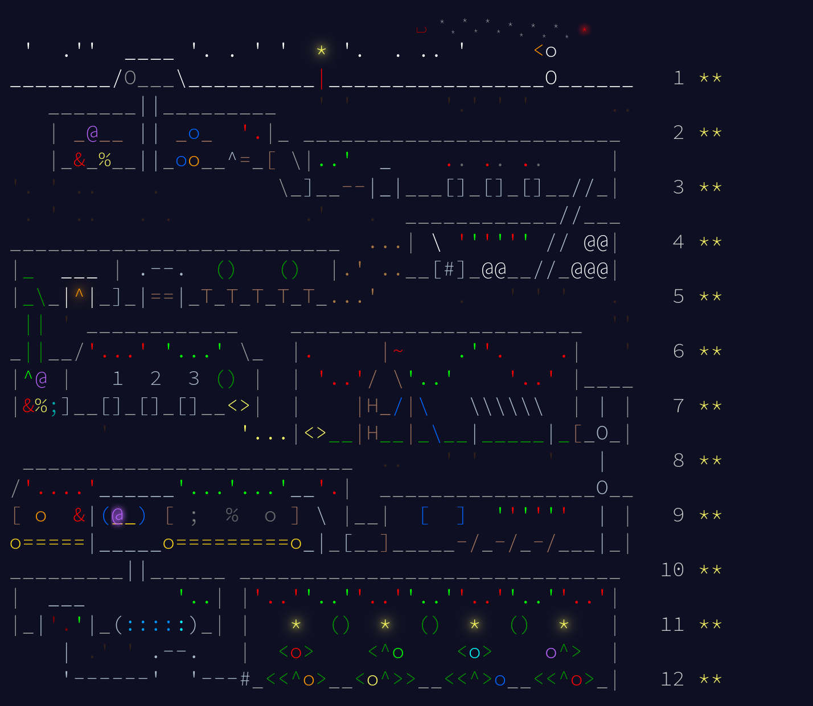
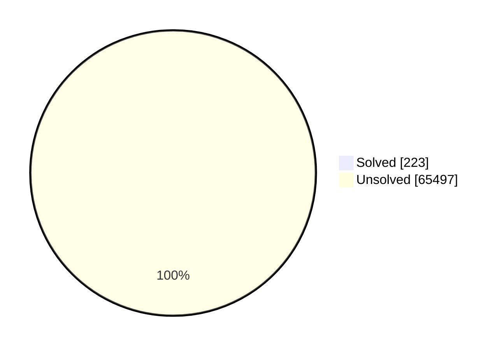
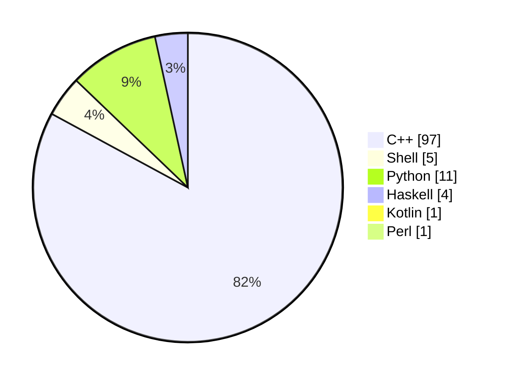

# problem-sets

This repository contains my answers to problem sets from a wide range of judges, including **Aizu**, **Advent of Code**, **CodeChef**, **Codeforces**, **Codegolf**, **CSES**, **Deep-ML**, **DMOJ**, **EOlymp**, **HackerRank**, **Kattis**, **KiloNova**, **Leetcode**, **LibreOJ**, **Perl Weekly Review**, **Project Euler**, **SPOJ**, **Timus**, and more.

> **Note:** These solutions are intended as a learning experience rather than optimal references. Most were written directly to the relevant online judges.

See below for the current coverage and progress, and refer to [issues](https://github.com/trintlermint/problem-sets/issues) for open tasks (like building a scraper).

---

## Coverage at a Glance

- **Websites/judges covered:** 25
- **Total problems tracked:** 65,720 (and growing)
- **Solved:** 227
- **Progress:** ≈ 0.35% &nbsp; _(calculated as (227 / 65,720) × 100)_

See also: <code>./prog.sh</code> for a summary script.

---

## Milestones

  
**Advent of Code 2025 solved!**

---

## TODO

| Problem Name          | Directory         |
|-----------------------|------------------|
| Borya's Diagnosis     | `cf/main/879/a`  |
| The Next Palindrome   | `cc/5`           |
| Like the Bitset       | `cf/main/2136/b` |

---

## Community Notes

**[Join our Discord server (Work in Progress)](https://discord.gg/sv7ku23K7y):**  
Weekly contests, editorials, code/runtime comparisons, and personal progress tracking. Plans include a `/videos/` section for walkthroughs and more.

**Discord Channels (planned):**
- `#announcements` — Contest schedules, links, and judge picks.
- `#help` — Hints (no spoilers during contests).
- `#systems` — Tooling, IDE setup, scripts (e.g., `prog.sh`), and benchmarks.
- + `more. . .` - :)

**Weekly Contest Schedule:**
- New schedule every Sunday.
- At least one multi-judge set midweek and one on weekends.
- Rotating judge sources for diverse coverage. (Subject to university workload.)

**Participation Workflow (planned):**
1. Check `#announcements` for the week's picks.
2. Work locally during competition windows.
3. After lock, share solutions and editorials.
4. Discuss blocks in `#help` and note tooling in `#systems`.

**Bot Development:**  
Open to recommendations for a submissions bot! See [aoc golf bot](https://github.com/Starwort/advent-of-code-golf-2025) for inspiration. Suggest ideas in Discord.

---

## Aim & Current Stats

**As of 2025-10-14**

| Platform         | Solutions   |
|------------------|------------|
| Codeforces       | 11,352      |
| CSES             | 362         |
| Project Euler    | 954         |
| ...              | ...         |

## Solution Status

## Solution Languages used

## Git Formatting

- When adding a solution file, use platform aliases in commit messages:
    - `cf` for Codeforces
    - `cses` for CSES
    - ... as specified in below websites

- **Commit Message Example:**
    - Adding a new Codeforces solution:  
      `cf: solution for problem 123A`

- If you add a new file unrelated to problem solutions (e.g., scripts, configs), use the `chore` or `init` or others as general conventions as prefixes:  
    - `chore: add prog.sh for summary automation`
    - `init: setup initial project structure`
    - `refactor: change the repository without changing program code`

## Websites mentioned

These are the lists of websites I am willing to contribute solutions to, along with their shorthand git aliases which I construct when I make a commit.

- `aoc` :: [Advent of Code](https://adventofcode.com)
- `aiz` :: [Aizu](https://onlinejudge.u-aizu.ac.jp)
- `cc`  :: [CodeChef](https://www.codechef.com/practice)
- `cf`  :: [Codeforces](https://codeforces.com/problemset)
- `cg`  :: [CodeGolf](https://code.golf)
- `cses`:: [CSES](https://cses.fi/problemset)
- `dml` :: [Deep-ML](https://www.deep-ml.com/problems)
- `dmoj`:: [DM::OJ](https://dmoj.ca/problems)
- `eol` :: [Eolymp](https://eolymp.com/en/problems)
- `hr`  :: [HackerRank](https://www.hackerrank.com)
- `js`  :: [Jane Street](https://www.janestreet.com/puzzles)
- `kat` :: [Kattis](https://open.kattis.com/problems)
- `kn`  :: [Kilonova](https://kilonova.ro/problems)
- `lc`  :: [LeetCode](https://leetcode.com/problemset)
- `lboj`:: [LibreOJ](https://loj.ac/p)
- `lioj`:: [LightOJ](https://lightoj.com/problems/category)
- `oj`  :: [oj.uz](https://oj.uz/problems)
- `pwc` :: [Perl The Weekly Challenge](https://theweeklychallenge.org/challenges)
- `pe`  :: [Project Euler](https://projecteuler.net/archives)
- `qoj` :: [QOJ.ac](https://qoj.ac/problems)
- `spoj`:: [SphereOJ](https://www.spoj.com/problems/classical)
- `tim` :: [Timus](https://acm.timus.ru/problemset.aspx)
- `tlx` :: [TLX](https://tlx.toki.id/problems)
- `toph`:: [Toph](https://toph.co/problems)
- `yos` :: [yosupo](https://judge.yosupo.jp)

## Redundancies:

| Problem Name | Presence In                                  | Directory |
|--------------|----------------------------------------------|-----------|
| aplusb       | Codeforces (ACMSGURU), Timus, Kilonova, LibreOJ | Timus     |

---

Feel free to open issues for suggestions, improvements, or questions! - trintler
