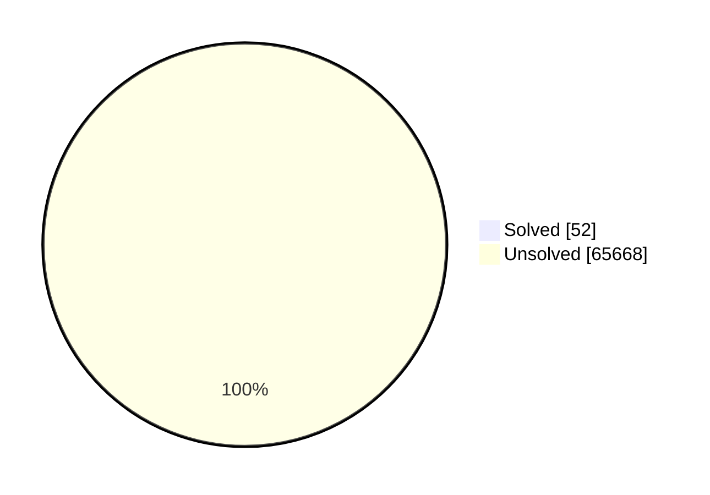
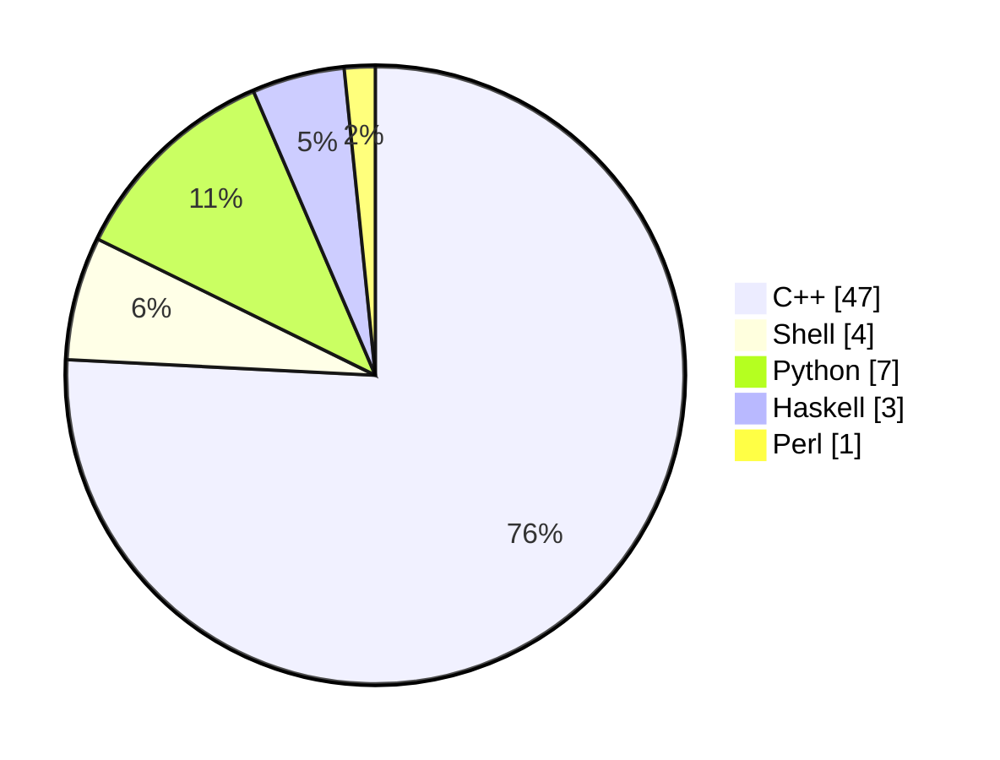

# problem-sets

My answers to the problem sets for CSES, timus, CodeForces, LeetCode, Deep-ML, Project Euler, Perl Weekly Review. These solutions are not the most practical or efficient, I have written each submimission and their runtime & memory usage within the respective content judge. This is a learning experience of mine.

## TODO:

| Problem Name       | Directory                      |
|--------------------|--------------------------------|
| boryas diagnosis  | cf/main/879/a                  |
| the next palindrome | cc/5 |
| like the bitset | cf/main/2136/b |
---

## AIM

**As of 14/10/2025:**

| Platform      | Solutions |
|---------------|-----------|
| Codeforces    | 11,353-1  |
| CSES          | 362       |
| Project Euler | 954       |
| LeetCode      | 3,716+1     |
| Timus         | 1,199     |
| Deep-ML       | 187       |
| Perl Weekly Review | 343  |
| SPOJ          | 42573     |
| CodeChef      | 5033       |
| Kattis | TBD |
- **Total problems:** 65720
- **Solved:** 52
- **Unsolved:** 65668
- **Progress:** 52 / 65720 × 100 ≈ 0.0791 %

see also: <code>./prog.sh</code> for summary

## Solution Status

## Solution Languages used

## Git Formatting

- When adding a solution file, use platform aliases in commit messages:
    - `cf` for Codeforces
    - `cses` for CSES
    - `pe` for Project Euler
    - `lc` for LeetCode
    - `timus` for Timus
    - `dml` for Deep-ML
    - `pwr` for Perl Weekly Review
    - `spoj` for Sphere Online Judge
    - `cc` for codechef
    - `kat` for kattis
- **Commit Message Example:**
    - Adding a new Codeforces solution:  
      `cf: solution for problem 123A`

- If you add a new file unrelated to problem solutions (e.g., scripts, configs), use the `chore` or `init` prefix:  
    - `chore: add prog.sh for summary automation`
    - `init: setup initial project structure`

## Redundancies:

| Problem Name | Presence In                                 | Directory |
|--------------|---------------------------------------------|-----------|
| aplusb       | Codeforces (ACMSGURU), Timus                | Timus     |
---

