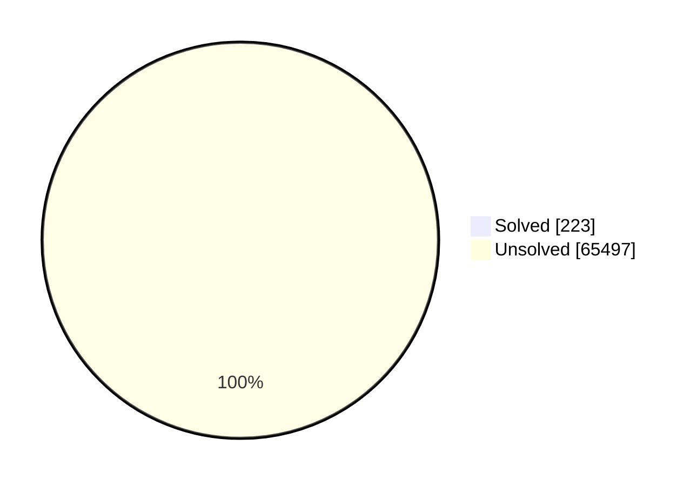
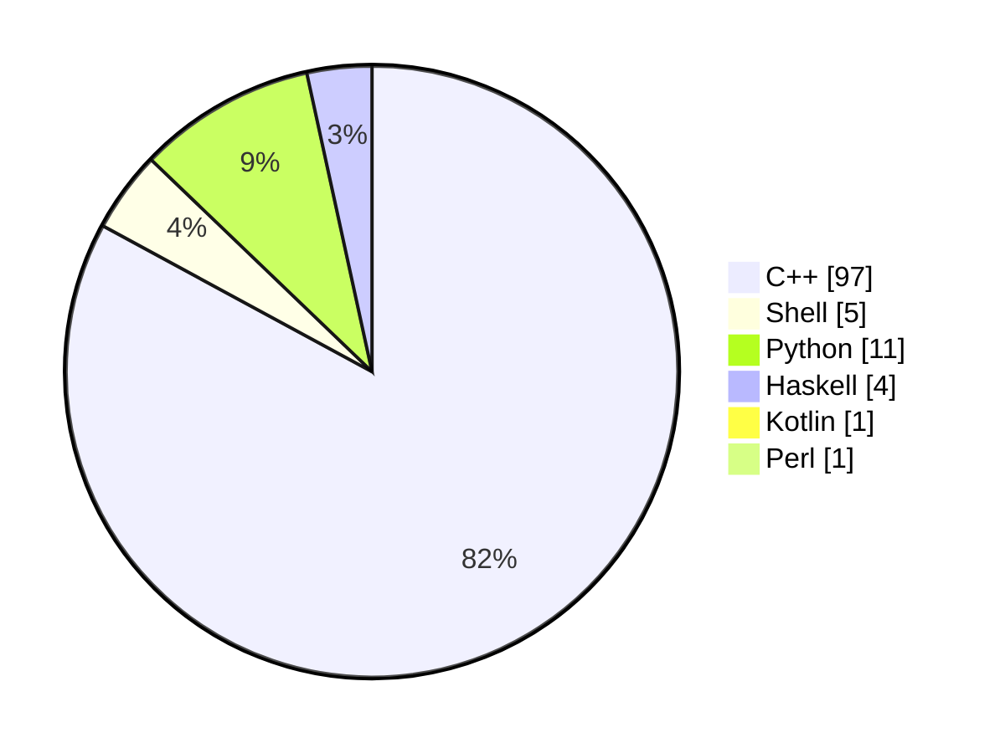

# problem-sets

My answers to the problem sets for Aizu, AdventofCode, CodeChef, Codeforces, Codegolf, CSES, Deep-ML, DMOJ, EOlymp, HackerRank, Kattis, KiloNova, Leetcode, LibreOJ, Perl Weekly Review, Project Euler, SPOJ and Timus judges. These solutions are not the most practical or efficient; I have written each submission and their runtime & memory usage within the respective content judge. This is a learning experience of mine, see below what judges are present in the repostiory. also please see issues for making a scraper! :)

## Coverage at a glance

- **This repository covers problem sets from 26 websites/judges.**
- **Total problems:** 65720 + more...TBD
- **Solved:** 227
- **Progress:** ((228 − 1) / 65720) × 100 ≈ 0.3454047474

see also: <code>./prog.sh</code> for summary

## Community notes

**[Discord Server (WIP)](https://discord.gg/sv7ku23K7y)** I will be coordinating weekly contests, share editorials, compare runtimes/memory, and track personal progress, this will be for enjoying together, furthermore I want to make a /videos/ repository where I upload videos on youtube + more.. about problems and solving them.
- **channels (TBD)**
  - `#announcements` — contest schedule, links, and judge picks for the week.
  - `#check-in` — who is participating this week; start/finish pings.
  - `#help` — hints only (no full spoilers during live windows).
  - `#systems` — tooling, IDE setups, scripts (e.g., `prog.sh`) and benchmarks.
- **Weekly cadence:**
  - Post schedule every Sunday; run at least one multi-judge set midweek and one weekend set. (when my uni gets bit less workload)
  - Rotate judges so coverage stays broad if thats what people want (Codeforces/CSES/LeetCode/Timus/Project Euler/etc.).
- **Participation workflow (TBD):**
  1) Check `#announcements` for the week’s picks.  
  2) During the window, work locally; note runtimes/memory on judge submissions.  
  3) After lock, share solutions + short commentary in `#solutions`; add editorials in `#editorials`.  
  4) Log issues/blocks in `#help`; capture tooling notes in `#systems`.
- **Bot**
    I am very inclined and open to recieving recommendations as to how to make a bot to be able to read submissions and have them, we also have a channel for advent of code golfing using the [aoc golf bot](https://github.com/Starwort/advent-of-code-golf-2025)

## Milestones

Advent of code 2025 solved!

## Stats

**As of 14/10/2025:**

| Platform            | Solutions |
|---------------------|-----------|
| Codeforces          | 11,353-1  |
| CSES                | 362       |
| Project Euler       | 954       |
| LeetCode            | 3,716+1   |
| Timus               | 1,199     |
| Deep-ML             | 187       |
| Perl Weekly Review  | 343       |
| SPOJ                | 42573     |
| CodeChef            | 5033      |
| Kattis              | TBD       |

## Solution Status

## Solution Languages used

## Git Formatting

- When adding a solution file, use platform aliases in commit messages:
    - `cf` for Codeforces
    - `cses` for CSES
    - `pe` for Project Euler
    - `lc` for LeetCode
    - `timus` for Timus
    - `dml` for Deep-ML
    - ... as specified in below websites

- **Commit Message Example:**
    - Adding a new Codeforces solution:  
      `cf: solution for problem 123A`

- If you add a new file unrelated to problem solutions (e.g., scripts, configs), use the `chore` or `init` prefix:  
    - `chore: add prog.sh for summary automation`
    - `init: setup initial project structure`

## Websites mentioned

These are the lists of websites I am willing to contribute solutions to, along with their shorthand git aliases which I construct when I make a commit.

- `aoc` :: [Advent of Code](https://adventofcode.com)
- `aiz` :: [Aizu](https://onlinejudge.u-aizu.ac.jp)
- `cc`  :: [CodeChef](https://www.codechef.com/practice)
- `cf`  :: [Codeforces](https://codeforces.com/problemset)
- `cg`  :: [CodeGolf](https://code.golf)
- `cses`:: [CSES](https://cses.fi/problemset)
- `dml` :: [Deep-ML](https://www.deep-ml.com/problems)
- `dmoj`:: [DM::OJ](https://dmoj.ca/problems)
- `eol` :: [Eolymp](https://eolymp.com/en/problems)
- `hr`  :: [HackerRank](https://www.hackerrank.com)
- `js`  :: [Jane Street](https://www.janestreet.com/puzzles)
- `kat` :: [Kattis](https://open.kattis.com/problems)
- `kn`  :: [Kilonova](https://kilonova.ro/problems)
- `lc`  :: [LeetCode](https://leetcode.com/problemset)
- `lboj`:: [LibreOJ](https://loj.ac/p)
- `lioj`:: [LightOJ](https://lightoj.com/problems/category)
- `oj`  :: [oj.uz](https://oj.uz/problems)
- `pwc` :: [Perl The Weekly Challenge](https://theweeklychallenge.org/challenges)
- `pe`  :: [Project Euler](https://projecteuler.net/archives)
- `qoj` :: [QOJ.ac](https://qoj.ac/problems)
- `spoj`:: [SphereOJ](https://www.spoj.com/problems/classical)
- `tim` :: [Timus](https://acm.timus.ru/problemset.aspx)
- `tlx` :: [TLX](https://tlx.toki.id/problems)
- `toph`:: [Toph](https://toph.co/problems)
- `yos` :: [yosupo](https://judge.yosupo.jp)

## Redundancies:

| Problem Name | Presence In                                  | Directory |
|--------------|----------------------------------------------|-----------|
| aplusb       | Codeforces (ACMSGURU), Timus, Kilonova, LibreOJ | Timus     |
---
