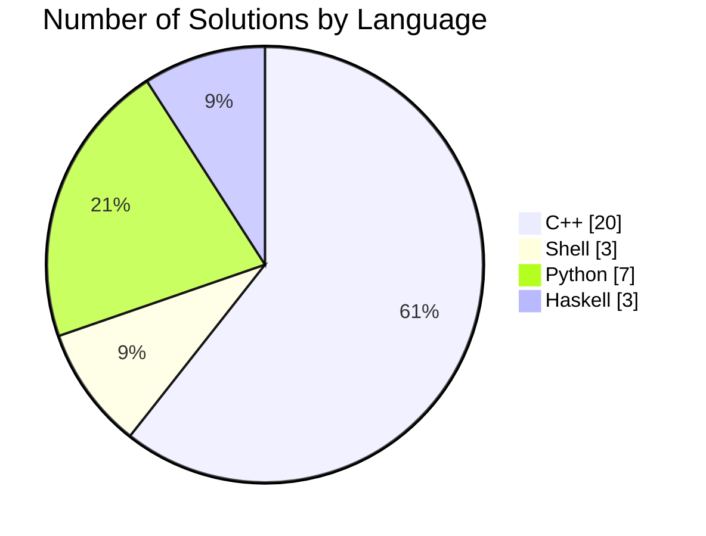
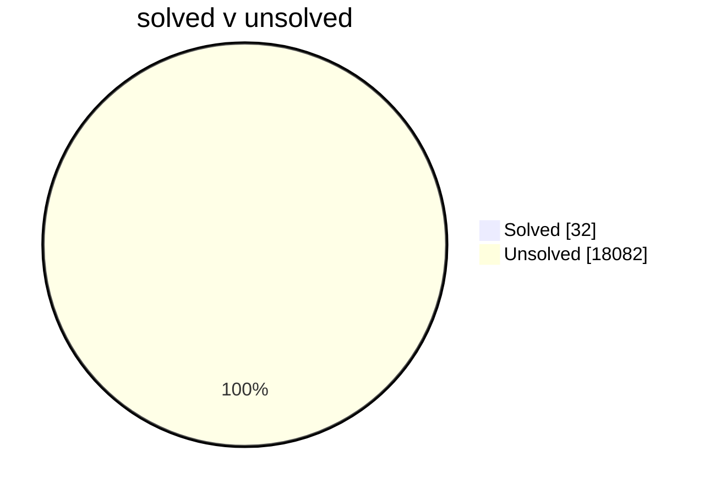

# problem-sets

My answers to the problem sets for CSES, timus, CodeForces, LeetCode, Deep-ML, Project Euler, Perl Weekly Review.

## TODO:

| Problem Name       | Directory                      |
|--------------------|--------------------------------|
|                    |                                |
---

## AIM: 

as of 14/10/2025;
cf : 10800 + 553
cses : 362
pe : 954
lc : 3716
timus : 1199
dl : 187
pwr : 343

sum = 18114;
- use prog.sh
progress = 32 / 18114 × 100 ≈ 0.1766589378 %

## Solution Status

## Git Formatting:

each file problem uploaded, use the aliases eg "cf, cses, ..." further,\n
there are chore if or init if adding a new file

## Redundancies:

| Problem Name | Presence In                                 | Directory |
|--------------|---------------------------------------------|-----------|
| aplusb       | Codeforces (ACMSGURU), Timus                | Timus     |
---

